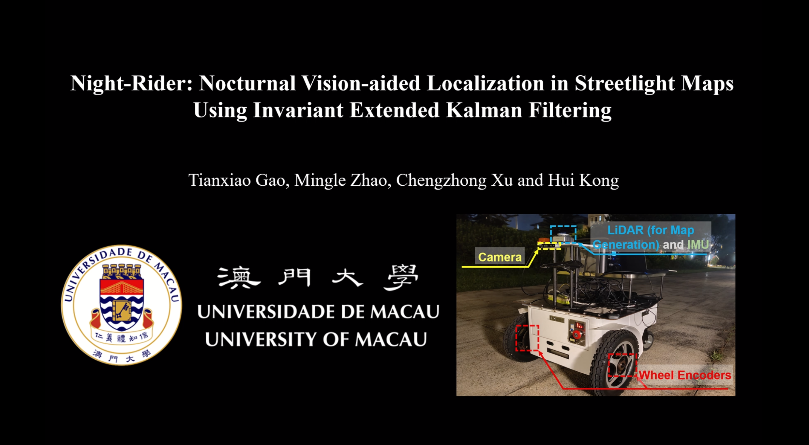

This is the code repository for the ICRA'24 paper "**Night-Rider: Nocturnal Vision-aided Localization in Streetlight Maps Using Invariant Extended Kalman Filtering**"

[](http://www.youtube.com/watch?v=Hs067MNuoQE "Night-Rider: Nocturnal Vision-aided Localization in Streetlight Maps Using Invariant Extended Kalman Filtering")

# Usage:
The repository has been tested in Ubuntu 18.04 with ROS Melodic. To setup Night-Rider, install the dependencies with command lines below.
1. Dependencies

- [Opencv 3.2](https://github.com/opencv/opencv)
- Eigen3
- [PCL 1.8](https://github.com/PointCloudLibrary/pcl)
- [Sophus](https://github.com/strasdat/Sophus)
- [GeographicLib](https://github.com/geographiclib/geographiclib)

2. Streetlight Map

The streetlight map is stored in /pcd folder. We use [FAST_LIO_LC](https://github.com/yanliang-wang/FAST_LIO_LC) and detected streetlights to filter streetlight points. The cloudcompare tool and DBSCAN algorithm enable us to further refine the streetlight map.

3. Dataset

Our collected mapping and localization sequences can be downloaded [here](https://pan.baidu.com/s/1lTJJyn117YQwDoPfTXtw9w?pwd=5vr5) 

4. Quick Start
```bash
mkdir -p ws_night_rider/src
cd ws_night_rider/src
git clone https://github.com/IMRL/Night-Rider.git
cd ws_night_rider/src && catkin_make
source devel/setup.bash
roslaunch map_relocalization scene2.launch
### Open with another terminal ###
cd /path/to/bag
rosbag play scene2.bag
```

# Reference:
Tianxiao Gao, Mingle Zhao, Chengzhong Xu, and Hui Kong, Night-Rider: Nocturnal Vision-aided Localization in Streetlight Maps Using Invariant Extended Kalman Filtering, 
IEEE International Conference on Robotics and Automation (ICRA), 2024. [[**PDF**](https://ieeexplore.ieee.org/document/10611408)]

# Acknowledgement:
Part of the codes are based on [FAST_LIO_LC](https://github.com/yanliang-wang/FAST_LIO_LC) and [InEKF](https://github.com/UMich-CURLY/husky_inekf.git). Thanks for their awesome work.
